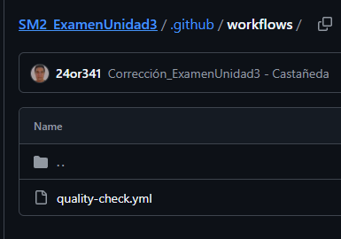
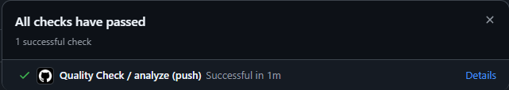
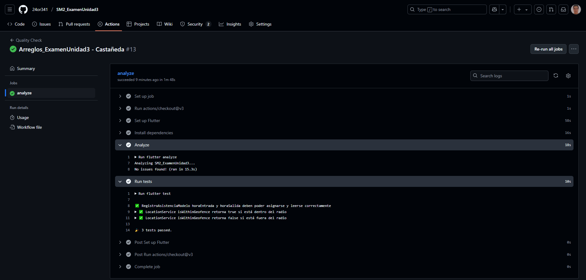

# SM2_ExamenUnidad3

**Curso:** Soluciones Móviles II <br>
**Fecha:** 27/06/2025  
**Estudiante:** Jorge Enrique Castañeda Centurión<br>
**Código:** 2021069822

---

## 🔗 Repositorio en GitHub

[https://github.com/24or341/SM2_ExamenUnidad3](https://github.com/24or341/SM2_ExamenUnidad3)

---

## 📁 Evidencias

### 1. Estructura de carpetas `.github/workflows/`



```plaintext
SM2_EXAMENUNIDAD03/
├── .github/
│   └── workflows/
│       └── quality-check.yml
├── lib/
├── test/
└── README.md
```
---

### 2. Contenido del archivo `quality-check.yml`

```yaml
name: Quality Check

on:
  push:
    branches: [main]
  pull_request:
    branches: [main]

jobs:
  analyze:
    runs-on: ubuntu-latest

    steps:
      - uses: actions/checkout@v3

      - name: Set up Flutter
        uses: subosito/flutter-action@v2
        with:
          flutter-version: '3.32.5' 

      - name: Install dependencies
        run: flutter pub get

      - name: Analyze
        run: flutter analyze

      - name: Run tests
        run: flutter test

```

---

### 3. Ejecución del workflow en la pestaña Actions




---

## 🧠 Explicación de lo realizado

Este proyecto corresponde al Examen Práctico de la Unidad III del curso **Soluciones Móviles II**. Se desarrollaron pruebas de calidad mediante GitHub Actions para el proyecto de Unidad del curso.

### 📌 Objetivo:
Automatizar la validación de calidad de código mediante:
- `flutter analyze`: revisión de buenas prácticas y código limpio.
- `flutter test`: ejecución de pruebas unitarias para asegurar el correcto funcionamiento de componentes clave.

### ✅ Pasos realizados:
1. Se creó un archivo `.github/workflows/quality-check.yml` con los pasos necesarios para instalar Flutter, dependencias, analizar y ejecutar tests.
2. Se colocaron **3 pruebas unitarias** dentro del archivo `test/main_test.dart`.
3. Se subió el proyecto a GitHub en un repositorio público.
4. Se activó GitHub Actions, lo cual ejecutó el flujo de trabajo automáticamente al hacer push a la rama `main`.
5. Se corrigieron errores y advertencias hasta lograr una ejecución **exitosa** del workflow.

---

**Resultado:**  
Se logró cumplir con todos los requisitos de la evaluación, automatizando correctamente la validación de calidad del proyecto Flutter mediante GitHub Actions.
